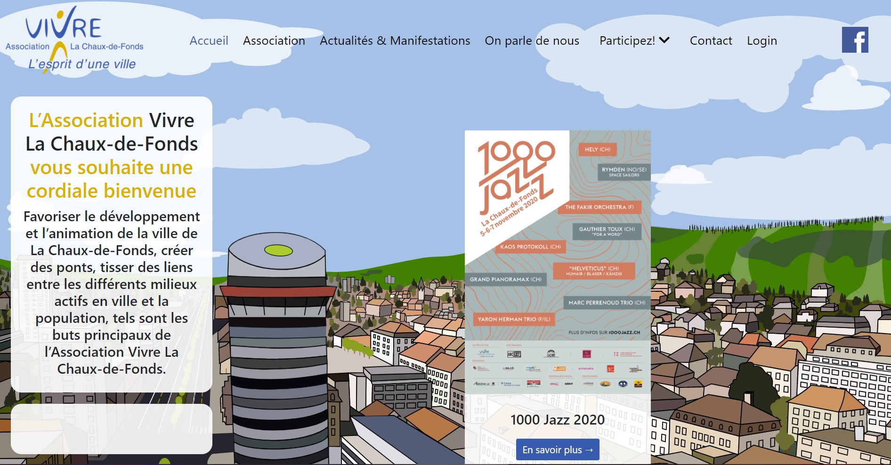

# vlcf.ch

"Vivre La Chaux-de-Fonds" est une association à but non lucratif basée à la Chaux-de-Fonds.



## Environment

PHP v7
Node v16

## Content

To install Laravel packages:
```bash
composer install
```

To install node packages:
```bash
npm install
```

To launch development server:
```bash
php artisan serve
```

To launch dev environment with Laravel Valet:
```bash
npm run watch #or for hot reload:
npm run hot
```

To create and populate database tables:
```bash
php artisan migrate:refresh
php artisan db:seed
```

To open database, launch MySQL Workbench.

To see the app, visit localhost:8000 in the browser.


## Team
- Jean-Marc (développeur web)
